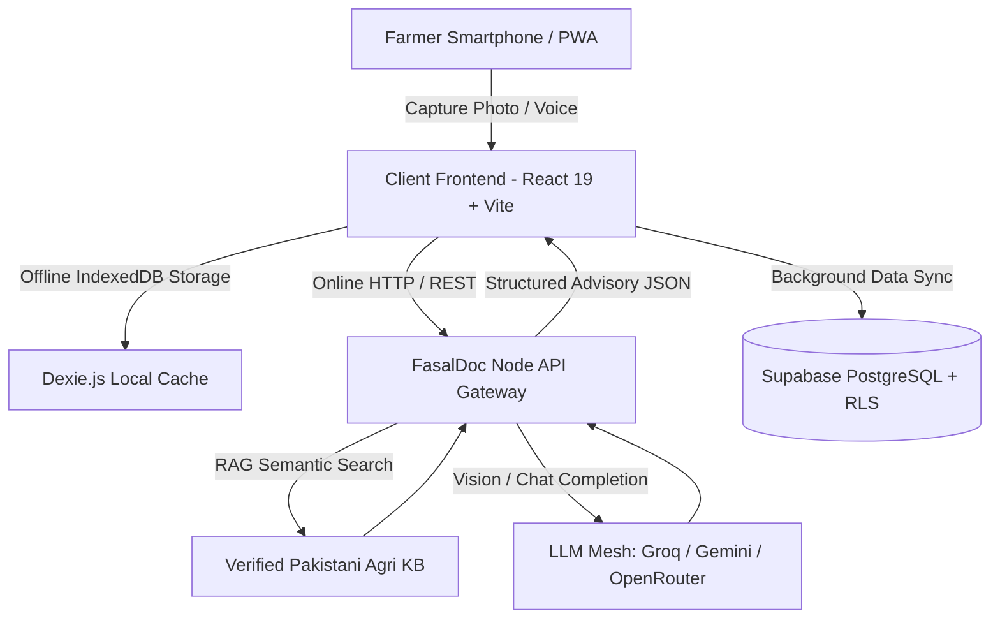

# 🌱 FasalDoc — AI-Powered Crop & Livestock Health Intelligence

> **Empowering 8M+ Smallholder Farmers Across Pakistan with Edge Computer Vision, Multi-Modal RAG Knowledge Systems, and Offline-First Agricultural Healthcare.**

[](https://react.dev/)
[](https://vitejs.dev/)
[](https://nodejs.org/)
[](https://supabase.com/)
[](https://groq.com/)
[](LICENSE)

---

## 📌 Executive Summary

**FasalDoc** is an AgriTech startup platform built to bridge the critical veterinary and agricultural extension gap in South Asia. Smallholder farmers face up to **35-40% annual crop loss and severe livestock mortality** due to delayed diagnosis, remote farmland locations, and lack of affordable agronomic expertise.

FasalDoc provides an **instant, bilingual (Urdu & English), multi-modal AI companion** that runs right from the farmer's smartphone camera — diagnosing plant pathologies and animal diseases in real-time, delivering certified chemical + organic remedies with exact dosages and local Pakistani brand recommendations, fully operable **online or completely offline**.

---

## 🚀 Key Value Propositions & Features

### 📸 1. Multi-Modal Vision Diagnosis (Crop & Livestock)
- **Computer Vision Pipeline**: Real-time image capture with client-side canvas compression (max 1024px, JPEG q0.7) for low-bandwidth 2G/3G mobile networks.
- **Dual Diagnosis Engine**: Accurately classifies conditions across staple crops (*Wheat, Rice, Cotton, Tomato, Potato, Maize, Sugarcane*) and dairy livestock (*Cattle, Buffalo, Goat, Sheep*).
- **Verified Remedy Prescriptions**: Every diagnosis matches verified treatments detailing:
  - 🌿 **Organic / Traditional Home Remedies** (Sour buttermilk whey, neem extract, wood ash).
  - 🧪 **Chemical Treatment & Active Ingredients** with local Pakistani brand names (Syngenta, Bayer, FMC, Engro, ICI).
  - 💊 **Dosage per Acre / Kanal / Animal Weight**.
  - 🛡️ **Preventative agronomic measures**.

### 💬 2. Agricultural Voice & AI RAG Assistant
- **Bilingual Conversational Interface**: Native support for Nastaliq/Urdu (`ur-PK`) and English (`en-US`).
- **Voice-Enabled Speech Recognition**: Direct voice inquiry for low-literacy farmers.
- **Instant Domain RAG (Retrieval-Augmented Generation)**: Grounded agricultural knowledge base combining localized agronomic rules with LLM synthesis (Gemini 2.0, Groq Llama-3.3-70B, OpenRouter).
- **Sub-50ms Offline Fallback**: Generates instant structured remedy advice even with zero internet connectivity.

### 📶 3. Resilient Offline-First Architecture
- **Local Database (IndexedDB via Dexie.js)**: Scans, history, offline remedy catalogues, and chat sessions are stored locally on device.
- **Background Cloud Sync**: Automatically enqueues mutations and synchronizes with **Supabase PostgreSQL** via bidirectional reconciliation when connectivity is restored.
- **1-Tap Guest / Demo Mode**: Pre-seeded demo account for zero-friction evaluations, field tests, and judge demonstrations.

### 🛠️ 4. Farmer Utility Hub (`/tools`)
- **Fertilizer & NPK Dosage Calculator**: Custom per-acre/kanal calculation for DAP, Urea, SOP Potash, and Zinc.
- **Emergency Helpline Directory**: 1-tap direct phone dialing for local veterinary clinics and agricultural extensions.
- **Disease & Pathology Library**: Searchable database of 50+ localized crop pests and animal health conditions.
- **Interactive Pitch Deck**: Built-in executive slideshow for pitch competitions and investor demos.

---

## 🏗️ System Architecture



---

## 💻 Tech Stack

| Layer | Technologies | Purpose |
|---|---|---|
| **Frontend App** | React 19, TypeScript, Vite, TailwindCSS | High-performance mobile-first PWA with Urdu RTL/LTR layout |
| **Local Storage & Offline** | Dexie.js (IndexedDB), Service Workers, Workbox | 100% offline data durability and auto-sync queue |
| **Backend API** | Node.js, Express.js (ESM), REST | High-throughput AI proxy, rate-limiting, and RAG orchestrator |
| **AI / ML & Vision** | Gemini 2.0 Flash, Groq Llama-3.3-70B, Vision Models | Sub-second visual pathology diagnosis and natural language reasoning |
| **Knowledge Engine** | Custom Agricultural RAG Engine | Localized chemical/organic treatments for Pakistani farming ecosystems |
| **Database & Auth** | Supabase (PostgreSQL, Row Level Security, Auth) | Secure user accounts, history tracking, and farm profile management |

---

## 📁 Project Structure

```
FasalDoc_Complete/build/
├── src/                         # React 19 PWA Frontend
│   ├── components/              # Offline banners, UI controls, headers
│   ├── context/                 # AuthContext (Demo/Supabase) & LanguageContext (Urdu/English)
│   ├── lib/                     # API client, Dexie DB, RAG engine, remedy database
│   └── screens/                 # HomeScreen, CaptureScreen, AssistantScreen, ToolsScreen, AuthScreen
├── backend/                     # Node.js + Express AI Gateway
│   ├── src/
│   │   ├── server.js            # Express API server & routes (/api/diagnose, /api/chat)
│   │   ├── llm.js               # Multi-provider client (Gemini, Groq, OpenRouter)
│   │   ├── rag.js               # Domain RAG retrieval & knowledge engine
│   │   ├── diagnose.js          # Vision diagnosis processor & schema validation
│   │   └── remedyKeys.js        # Crop & livestock catalogue mapping
│   ├── package.json
│   └── .env.example
├── supabase/
│   └── schema.sql               # PostgreSQL tables, indexes & RLS policies
├── Startup/                     # Business Plans, Pitch Decks & Partnership Docs
└── vite.config.ts               # Vite PWA and build configuration
```

---

## ⚡ Quick Start Guide

### Prerequisites
- Node.js `>= 18.0.0`
- npm or pnpm

### 1. Clone & Setup Backend

```bash
cd backend
npm install
cp .env.example .env
```

*(Optional)* Add your free API keys to `backend/.env`:
```env
PORT=8000
GROQ_API_KEY=gsk_your_groq_api_key_here
GEMINI_API_KEY=AIzaSy_your_gemini_key_here
```

Start the backend:
```bash
npm start
# 🚀 Backend listening on http://localhost:8000
```

### 2. Setup & Run Frontend

In the root directory:
```bash
npm install
npm run dev
# 🌐 Live App accessible at http://localhost:5173
```

> **💡 Fast Demo Tip**: On the login screen, click **"Continue as Demo Farmer (چوہدری طارق)"** to explore all AI diagnosis, RAG chatbot, and tools features instantly with pre-seeded data.

---

## 🔒 Security & Data Privacy

- **Zero Client-Side API Keys**: All LLM and AI keys are securely held on the Node.js backend.
- **Row-Level Security (RLS)**: User scans, diagnoses, and personal farm data in Supabase are isolated strictly per authenticated user ID.
- **Client-Side Compression**: Photos are downscaled before transmission to protect bandwidth and reduce cloud computing latency.

---

## 📈 Startup Roadmap

- [x] **Phase 1 (MVP Launch)**: Dual Crop & Livestock Diagnosis + Offline RAG Chatbot + PWA.
- [ ] **Phase 2 (IoT & Weather Integration)**: Hyperlocal weather alerts, mandi (market) rate index, and soil sensor connectivity.
- [ ] **Phase 3 (B2B Marketplace)**: Direct Agri-input ordering with verified local fertilizer & pesticide distributors.
- [ ] **Phase 4 (Government & NGO Tele-Agri)**: Tele-veterinary consultation connecting remote farmers with certified doctors.

---

## 👥 Authors & Acknowledgements

- **MZunurain Tahir** — *Founder & Lead Architect* ([GitHub](https://github.com/MZunurainTahir))
- Developed for **HATCH / NSTP** Innovation Program.

---

<div align="center">
  <sub>Built with ❤️ for the hardworking farmers of Pakistan.</sub>
</div>
